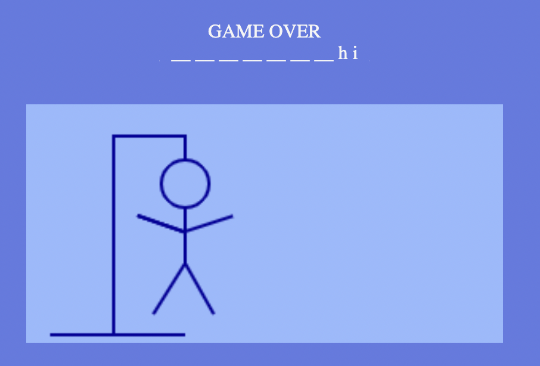
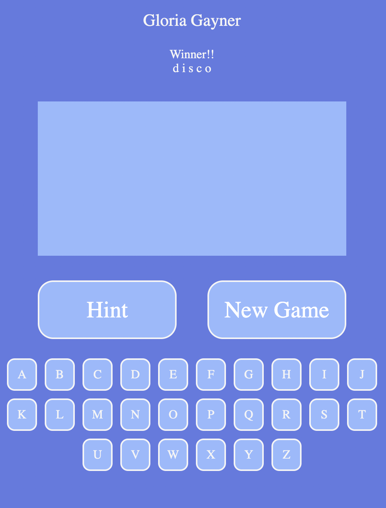

Hangman Game

In the classic game of Hangman, the player's objective is to identify the mystery word. In each round, the player will guess by clicking on the letters to reveal the mystery word in each round. When incorrect letter is clicked part of the stickman will draw withing the canvas. The game ends in a winner! if the word is entirely revealed by correct guesses, and ends in Game Over if the hangman's body is completely revealed. To assist the player, they may click on the hint button to reveal a clue.

Screenshots

Technologies Used:
HTML, 
CSS, 
JavaScript, 
DOM

Deployment
To deploy this project run
https://lilyobeng.github.io/Hangman/

Future enhancements:
Mobile-friendly User Interface,
Add more categories to my game 

